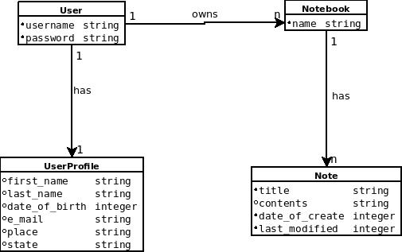
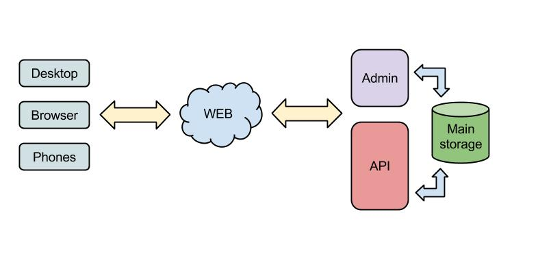

Architecture
============

REST API
++++++++

The Django REST_ framework is powerful, sophisticated, and surprisingly easy to use. It offers an attractive,
web browseable version of your API, and the option of returning raw JSON. The Django Rest Framework provides
powerful model serialization, display data using standard function based views, or get granular with powerful
class based views for more complex functionality. All in a fully REST compliant wrapper.

Despite being simple, REST is fully-featured, there's basically nothing you can do in Web
Services that can't be done with a RESTful architecture.

Diagram
-------

Design of data model
++++++++++++++++++++

System overview
+++++++++++++++

.. _REST: http://www.django-rest-framework.org/

